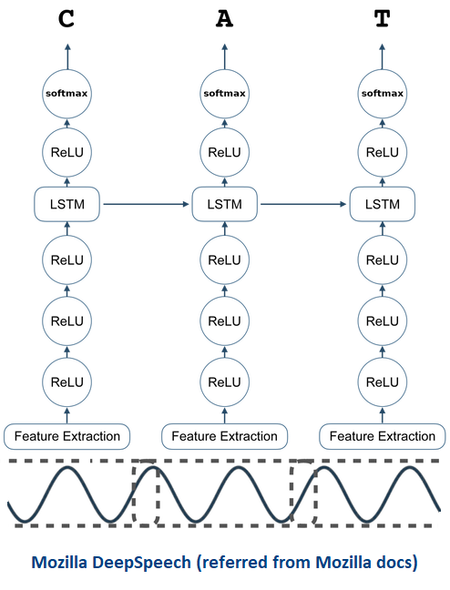

# Automatic Speech Recognition (ASR) - DeepSpeech Swiss German

_This is the project for the paper [LTL-UDE at Low-Resource Speech-to-Text Shared Task : Investigating Mozilla DeepSpeech in a low-resource setting]() published at [SWISSTEXT 5th and KONVENS 2020](https://swisstext-and-konvens-2020.org/)._

This project aims to develop a working Speech to Text module using [Mozilla DeepSpeech](https://github.com/mozilla/DeepSpeech), which can be used for any Audio processing pipeline. [Mozillla DeepSpeech](https://github.com/mozilla/DeepSpeech) is a state-of-the-art open-source automatic speech recognition (ASR) toolkit. DeepSpeech is using a model trained by deep learning techniques based on [Baidu's Deep Speech](https://gigaom2.files.wordpress.com/2014/12/deep_speech3_12_17.pdf) research paper. Project DeepSpeech uses Google's TensorFlow to make the implementation easier.

<p align="center">
	
</p>


## Important Links:

**Paper:** 

**DeepSpeech-API:** https://github.com/AASHISHAG/DeepSpeech-API

This Readme is written for [DeepSpeech v0.6.0](https://github.com/mozilla/DeepSpeech/releases/tag/v0.6.0). Refer to [Mozillla DeepSpeech](https://github.com/mozilla/DeepSpeech) for lastest updates.

## Contents

1. [Requirements](#requirements)
2. [Speech Corpus](#speech-corpus)
3. [Language Model](#language-model)
4. [Training](#training)
5. [Results](#results)
6. [Trained Models](#trained-models)
7. [Acknowledgments](#acknowledgments)
8. [References](#references)

### Requirements

#### Installing Python bindings

```
virtualenv -p python3 deepspeech-german
source deepspeech-german/bin/activate
pip3 install -r python_requirements.txt
```

#### Mozilla DeepSpeech

```
$ git clone https://github.com/mozilla/DeepSpeech.git
$ cd DeepSpeech
$ git checkout v0.6.0
$ docker build -t deepspeech_v0.6.0 .
$ docker run -d -it --name deepspeech_v0.6.0 --mount  type=bind,source="$(pwd)",target=/root deepspeech_v0.6.0
$ docker exec -it deepspeech_v0.6.0 /bin/bash
```

- Set the locale to en_US.UTF-8 if required:
```
$ dpkg-reconfigure locales
$ https://perlgeek.de/en/article/set-up-a-clean-utf8-environment <reference>
```

### Speech Corpus

**1. _English_**
* [Mozilla Common Voice](https://voice.mozilla.org/) ~1488h
* [LibriSpeech](http://www.openslr.org/12) ~1000h 

**2. _German_**
* [Mozilla Common Voice](https://voice.mozilla.org/) ~454h
* [Mailabs](https://www.caito.de/2019/01/the-m-ailabs-speech-dataset/) ~233h
* [German Distant Speech Corpus (TUDA-De)](https://www.inf.uni-hamburg.de/en/inst/ab/lt/resources/data/acoustic-models.html) ~184h
* [Voxforge](http://www.voxforge.org/home/forums/other-languages/german/open-speech-data-corpus-for-german) ~57h

**3. _Swiss-German_**
* [ArchiMob](https://www.spur.uzh.ch/en/departments/research/textgroup/ArchiMob.html) ~57h
* [SwissText](https://swisstext-and-konvens-2020.org/low-resource-speech-to-text/) ~70h


- **Download and Prepare the Audio Data**

**1. _Mozilla_EN_**
```
$ mkdir mozilla_en
$ cd mozilla_en
$ wget https://voice-prod-bundler-ee1969a6ce8178826482b88e843c335139bd3fb4.s3.amazonaws.com/cv-corpus-4-2019-12-10/en.tar.gz
$ tar -xzvf en.tar.gz
$ python3 DeepSpeech/bin/import_cv2.py --audio_dir path --filter_alphabet deepspeech-swiss-german/data/en_alphabet.txt export_path <change the path accordingly>
```

**2. _LibriSpeech_EN_**
```
$ mkdir librispeech
$ cd librispeech
$ python3 DeepSpeech/bin/import_librivox.py $export_path <change the path accordingly>
```

**3. _Mozilla_DE_**
```
$ mkdir mozilla_de
$ cd mozilla_de
$ wget https://voice-prod-bundler-ee1969a6ce8178826482b88e843c335139bd3fb4.s3.amazonaws.com/cv-corpus-4-2019-12-10/de.tar.gz
$ tar -xzvf de.tar.gz
$ python3 DeepSpeech/bin/import_cv2.py --audio_dir path --filter_alphabet deepspeech-swiss-german/data/de_alphabet.txt $export_path <change the path accordingly>
```

**4. _Mailabs_DE_**
```
$ mkdir mailabs
$ cd mailabs
$ python3 DeepSpeech/bin/import_m-ailabs.py --language de_DE --filter_alphabet deepspeech-swiss-german/data/de_alphabet.txt $export_path <change the path accordingly>
```

**5. _Tuda_DE_**
```
$ mkdir tuda
$ cd tuda
$ wget http://www.repository.voxforge1.org/downloads/de/german-speechdata-package-v2.tar.gz
$ tar -xzvf german-speechdata-package-v2.tar.gz
$ deepspeech-swiss-german/pre-processing/prepare_data.py --tuda corpus_path  export_path
```

**6. _Voxforge_DE_**
```
$ mkdir voxforge
$ cd voxforge
```
```python
from audiomate.corpus import io
dl = io.VoxforgeDownloader(lang='de')
dl.download(voxforge_corpus_path)
```
```
$ deepspeech-swiss-german/pre-processing/run_to_utf_8.sh
$ python3 deepspeech-swiss-german/prepare_data.py --voxforge corpus_path export_path <change the path accordingly>
```
_NOTE: Change the path accordingly in run_to_utf_8.sh_

**7. _SwissText_DE_**
```
$ mkdir swisstext
$ cd swisstext
$ https://drive.switch.ch/index.php/s/PpUArRmN5Ba5C8J <download link>
$ python3 deepspeech-swiss-german
```

**8. _ArchiMob_DE_**
- Follow steps at:
```
$ https://github.com/AASHISHAG/archimob-swissgerman-deepspeech-importer
```

### Language Model

We used [KenLM](https://github.com/kpu/kenlm.git) toolkit to train a 3-gram language model. It is Language Model inference code by [Kenneth Heafield](https://kheafield.com/)

- **Installation**

```
$ git clone https://github.com/kpu/kenlm.git
$ cd kenlm
$ mkdir -p build
$ cd build
$ cmake ..
$ make -j `nproc`
```

- **Corpus**

We used an open-source [German Speech Corpus](http://ltdata1.informatik.uni-hamburg.de/kaldi_tuda_de/German_sentences_8mil_filtered_maryfied.txt.gz) released by [University of Hamburg](https://www.inf.uni-hamburg.de/en/inst/ab/lt/resources/data/acoustic-models.html) and [European Parliament Proceedings Parallel Corpus 1996-2011](https://www.statmt.org/europarl/)

1. Download the data (EN, DE)

```
##EN

## DE
$ wget http://ltdata1.informatik.uni-hamburg.de/kaldi_tuda_de/German_sentences_8mil_filtered_maryfied.txt.gz
$ gzip -d German_sentences_8mil_filtered_maryfied.txt.gz
$ wget https://www.statmt.org/europarl/v7/de-en.tgz
$ gzip -d German_sentences_8mil_filtered_maryfied.txt.gz
```

2. Pre-process the data (EN, DE)

```
##EN

## DE
$ deepspeech-german/pre-processing/prepare_vocab.py $text_corpus_path $exp_path/clean_vocab.txt
```

3. Build the Language Model (EN, DE)
```
##EN

## DE
$kenlm/build/bin/lmplz --text $exp_path/clean_vocab.txt --arpa $exp_path/words.arpa --o 3
$kenlm/build/bin/build_binary -T -s $exp_path/words.arpa $exp_path/lm.binary
```

#### NOTE: use [-S](https://kheafield.com/code/kenlm/estimation/) memoryuse_in_%, if malloc expection occurs
Example:
```
##EN

## DE
$kenlm/build/bin/lmplz --text $exp_path/clean_vocab.txt --arpa $exp_path/words.arpa --o 3 -S 50%
```

4. Build Trie (EN, DE)
```
##EN

## DE
$ DeepSpeech/native_client/generate_trie deepspeech-swiss-german/data/de_alphabet.txt path/lm.binary export_path/trie
```


### Training

Define the path of the corpus and the hyperparameters in _deepspeech-german/train_model.sh_ file.

```
$ nohup deepspeech-german/train_model.sh &
```


### Results

Some results from our findings.

- 

_NOTE: Refer our paper for more information._

### Transfer Learning

**1. _German to German_**

- Specify the checkpoint directory in [trasfer_model.sh](https://github.com/AASHISHAG/deepspeech-german/blob/master/transfer_model.sh)

```
$ nohup deepspeech-german/trasfer_model.sh & 
```

**2. _English to German_**

- Change all umlauts characters ä,ö,ü,ß to ae, oe, ue, ss
- Re-build Language Model, Trie and Corpus

- Specify the checkpoint directory in [trasfer_model.sh](https://github.com/AASHISHAG/deepspeech-german/blob/master/transfer_model.sh)

```
$ nohup deepspeech-german/trasfer_model.sh & 
```

_NOTE: The checkpoints should be from the same version to perform Transfer Learning_


## Acknowledgments
* [Prof. Dr.-Ing. Torsten Zesch](https://www.ltl.uni-due.de/team/torsten-zesch) - Co-Author
 
## References
If you use our findings/scripts in your academic work, please cite:
```

```
